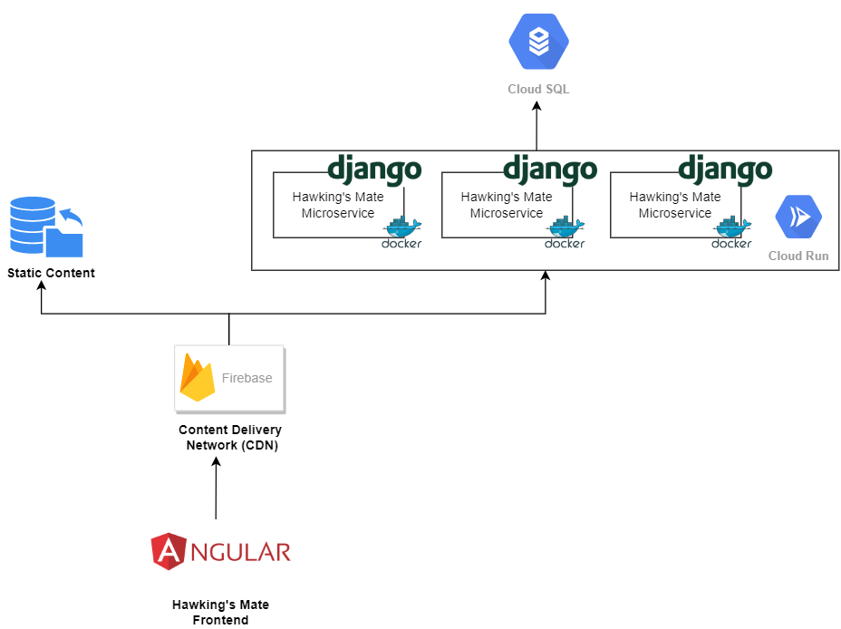

# Hawking's Mate
Hawking's Mate is a platform to support ALS patients during the course of their disease. The integrated
artificial intelligence has been trained on countless disease courses and is now able to act in advance
for patients. In a long term the platform can become the central location for acquiring and analyzing ALS
related data and accelerate, support research.

## Repository structure and setup
The repository is structured into backend and frontend. The backend is a Python Django microservice
and the frontend is an Angular application. How to setup the repository for development, please have a look
at the Readmes of the backend and frontend:
- [Backend](backend/README.md)
- [Frontend](frontend/guardian/README.md)

## System Architecture
The System was designed to be hosted in the Cloud or On-Premise. It is preferable to use a cloud environment to take advantage of managed services. However, because of the sensitivity of the data, a separate hosting with a service provider is also conceivable, the application can be transferred as a whole. Another big topic for our solution was scalability. For scaling our application to a thousands of users, we relay on auto-scaling features of the cloud providers. This means, if we want to scale out, we simply can scale the number of instances and vertically scale the database.

In the architecture diagram, it is shown how the system is setup. We use Google Firebase for hosting the static content and also use their Content Delivery Network (CDN) for low latency. API requests are routed through Firebase to our scalable backend. This in turn access the managed Cloud SQL database instance.

## Deployment
The deployment is fully automated through a continuous deployment pipeline with github actions. For creating a new version, please follow these steps:
1. Go to github and klick releases on the right
2. Go to "Draft new release"
3. Insert a new version number and click create release
4. In the background there is now the frontend build and deployed to firebase and also the docker image build, pushed to GCR
and the Cloud Run configuration updated.
5. You have a now a new release. Have fun!
